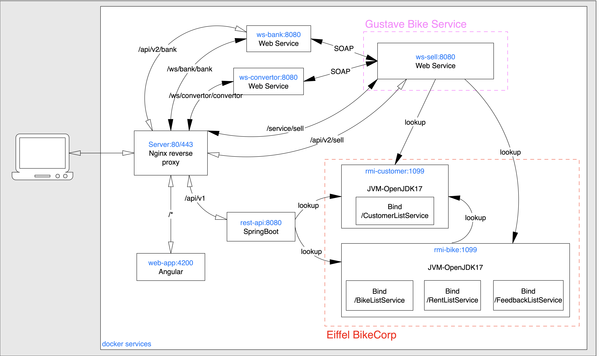

# Web Service Project

## Prerequisites

In order to run the project you'll need the following tools installed

* [Java 17](https://www.oracle.com/java/technologies/javase/jdk17-archive-downloads.html)
* [Maven 3.8.6](https://maven.apache.org/download.cgi)
* [Docker](https://www.docker.com/)


## Installation

1. First of all, you should clone this repository on your system using the following command.
```bash
git clone https://github.com/osmocode/web-service.git
```

2. Go to `web-service` directory, then execute the `./bin/install.sh` script, finally execute the `./bin/docker-up.sh` script for generate docker images of web-service and run containers.

```bash
cd web-service
```
```bash
./bin/install.sh
```
```bash
./bin/docker-up.sh
```

3. Once all services starts, open the browser on `localhost`

4. To shutdown all running containers execute the `./bin.docker-down.sh` script

```bash
./bin/docker-down.sh
```


## Project architecture
<p>
    
</p>


## Services
* [rest-api](./rest-api/README.md)
* [rmi-bike](./rmi-bike/README.md)
* [rmi-customer](./rmi-customer/README.md)
* [web-app](./web-app/README.md)
* [web-service-bank](./web-service-bank/README.md)
* [web-service-convertor](./web-service-convertor/README.md)
* [web-service-sell](./web-service-sell/README.md)